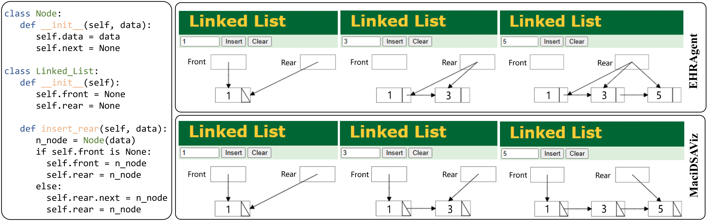
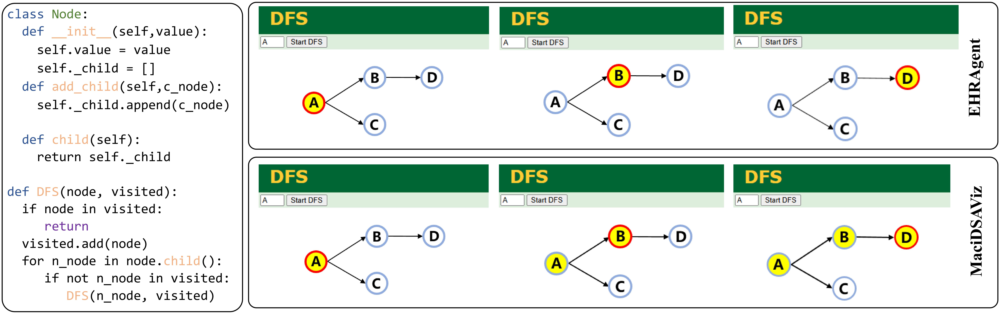

# MaciDSAViz

## MaciDSAViz
#### Our dataset and code are available in this reposistory.

### MaciDSAViz/dataset
#### Our dataset is in this folder with a csv showing the difficulty

### MaciDSAViz/MaciDSAViz
#### Our methods is in this folder 
**MaciDSAViz.py** is our method code, \
**Compile.py and Executor.py** are two automatic executors, \
**few-shot folder** is the code to calulate similarity and choose examples, \
**document folder** includes DSV documentation and tutorials.

#### Usage
in line 165 in **MaciDSAViz.py**,you should set your own key and url,model_path.
```
llm = ChatOpenAI(    
    api_key="xxxx",
    base_url="xxxx",
    model=MODEL_PATH
)
```
then run by the following commands:
```
python MaciDSAViz.py
```


### Case


### In the case of linked list, MaciDSAViz’s output closely aligns with the underlying logic, accurately representing pointer updates during insertion. In contrast, EHRAgent misleads users by incorrectly visualizing the relationships between front and rear pointers.



###  In the case of DFS, MaciDSAViz provides a clear and accurate visualization of the traversal process, effectively tracking the visited nodes. However, EHRAgent overlooks the representation of visited status, resulting in an incomplete or misleading depiction of the algorithm’s behavior


###  In the case of insert of BST, MaciDSAViz provides a clear and precise visualization of the insertion process, accurately illustrating the sequence of comparisons used to determine the correct position for each new node. In contrast, EHRAgent includes the overall insertion outcome but fails to depict the crucial comparison steps, resulting in an incomplete understanding of how the insertion position is determined within the tree structure.
